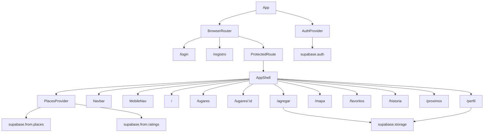

# Arquitectura — Senda

## Visión general

Senda es una SPA (Single-Page Application) React que se comunica directamente con Supabase. No hay servidor intermedio propio.

```
┌─────────────────────────────────────────┐
│              Browser (React SPA)         │
│                                         │
│  AuthContext ◄──── ProtectedRoute       │
│  PlacesContext ◄── Pages / Components   │
│       │                                 │
│  supabase.ts (JS client)                │
└────────────────┬────────────────────────┘
                 │ HTTPS (REST + Realtime)
┌────────────────▼────────────────────────┐
│              Supabase                    │
│  ┌──────────┐  ┌──────────┐  ┌───────┐ │
│  │ Auth     │  │PostgreSQL│  │Storage│ │
│  │(JWT/RLS) │  │(places,  │  │avatars│ │
│  │          │  │profiles, │  │photos │ │
│  │          │  │ratings)  │  │       │ │
│  └──────────┘  └──────────┘  └───────┘ │
└─────────────────────────────────────────┘
                 │ Git push
┌────────────────▼────────────────────────┐
│              Vercel                      │
│  Build: tsc -b && vite build            │
│  Serve: static dist/                    │
│  Env: VITE_SUPABASE_URL + ANON_KEY      │
└─────────────────────────────────────────┘
```

---

## Capas del sistema

### 1. Capa de entrada (`main.tsx`)
- Monta `<App />` en `#root`.
- No hace nada más.

### 2. Capa de routing y providers (`App.tsx`)
- `AuthProvider` envuelve todo: gestiona sesión Supabase, perfil, y funciones de auth.
- `BrowserRouter` con dos grupos de rutas:
  - Públicas: `/login`, `/registro`.
  - Protegidas: todo lo demás, envuelto en `ProtectedRoute` → `AppShell`.
- `AppShell`: monta `PlacesProvider` + `Navbar` + `main` + `MobileNav` + rutas hijas.
- `PlacesProvider` solo vive dentro de `AppShell` (no se carga en login/registro).

### 3. Capa de estado global (`src/context/`)

**AuthContext**
- Estado: `user` (Supabase User), `profile` (fila de `profiles`), `session`, `loading`, `configured`.
- Se inicializa con `getSession()` al montar.
- Escucha cambios con `onAuthStateChange` para mantener estado reactivo.
- Provee: `signUp`, `signIn`, `signOut`, `updateProfile`, `uploadAvatar`.

**PlacesContext**
- Estado: `places[]` (todos los lugares del usuario autenticado).
- Se carga al montar el `AppShell` con `fetchPlaces()`.
- No tiene paginación: carga todos los lugares (la app es para dos usuarios con pocos registros).
- Provee CRUD completo + sistema de ratings + `convertToMemory`.

### 4. Capa de infraestructura (`src/lib/`)

**supabase.ts**
- Crea y exporta el cliente Supabase.
- Exporta `SUPABASE_CONFIGURED` para evitar llamadas cuando las env vars son placeholder.
- Config: `autoRefreshToken: true`, `persistSession: true`, `detectSessionInUrl: false`.

**utils.ts**
- Helpers puros sin side effects: `typeLabel`, `priceLabel`, `formatDate`, `formatShortDate`, `priorityLabel`.

### 5. Capa de presentación (`src/pages/` + `src/components/`)

Componentes reutilizables:
- `PlaceCard`: tarjeta de lugar usada en Home, Lugares, Favoritos.
- `Navbar`: barra superior desktop con dropdown de perfil.
- `MobileNav`: barra inferior mobile (5 ítems principales).
- `ProtectedRoute`: guard de autenticación.

Páginas:
- Cada página es una función exportada con nombre, con su propio CSS.
- Consumen contexto vía hooks (`usePlaces`, `useAuth`).
- No hacen llamadas directas a Supabase, salvo `AgregarLugar` (upload de fotos directo al storage).

---

## Flujo de datos: agregar un lugar

```
Usuario llena form (AgregarLugar.tsx)
  → handleSubmit()
  → supabase.from('places').insert(payload)      ← directo al cliente
  → si hay fotos: supabase.storage.upload(...)
  → supabase.from('places').update({ photos })
  → si hay rating: PlacesContext.upsertRating()
    → supabase.from('ratings').upsert(...)
    → recalcPlaceAvg() → supabase.from('places').update({ rating_avg })
  → PlacesContext.refresh()                       ← re-fetch todos los lugares
  → navigate(`/lugares/${newPlace.id}`)
```

## Flujo de datos: calificar un lugar

```
Usuario escribe calificación (PlaceDetail.tsx)
  → PlacesContext.upsertRating(placeId, stars, comment)
  → supabase.from('ratings').upsert(payload, { onConflict: 'place_id,user_id' })
  → recalcPlaceAvg(placeId)
    → SELECT rating FROM ratings WHERE place_id = X
    → calcula avg en JS
    → UPDATE places SET rating_avg = avg WHERE id = X
    → setPlaces(prev => prev.map(...))            ← actualización optimista
```

---

## Organización de carpetas

```
src/
├── App.tsx          # Router + providers (no tiene lógica de negocio)
├── App.css          # Layout: .app-shell, .app-main
├── main.tsx         # Entry
├── index.css        # Design tokens, reset, tipografía global
│
├── types/
│   └── index.ts     # Place, Rating, PlaceType, Priority, PlaceInsert, RatingInsert
│
├── lib/
│   ├── supabase.ts  # UN solo cliente, exportado
│   └── utils.ts     # Helpers de formato/label, sin efectos
│
├── context/
│   ├── AuthContext.tsx   # Auth state + Profile
│   └── PlacesContext.tsx # Places + Ratings state + mutations
│
├── components/
│   ├── Navbar.tsx/.css
│   ├── MobileNav.tsx/.css
│   ├── PlaceCard.tsx/.css
│   └── ProtectedRoute.tsx
│
└── pages/
    ├── Login.tsx + Auth.css   # Reutiliza estilos con Register
    ├── Register.tsx
    ├── Home.tsx/.css
    ├── Lugares.tsx/.css
    ├── PlaceDetail.tsx/.css
    ├── AgregarLugar.tsx/.css
    ├── Mapa.tsx/.css
    ├── Favoritos.tsx/.css
    ├── Historia.tsx/.css
    ├── Proximos.tsx/.css
    └── Perfil.tsx
```

---

## Dependencias clave

| Paquete | Versión | Rol |
|---------|---------|-----|
| `react` | 19.x | UI |
| `react-router-dom` | 7.x | Routing (client-side) |
| `@supabase/supabase-js` | 2.x | DB + Auth + Storage |
| `leaflet` + `react-leaflet` | 1.9 / 5.x | Mapa interactivo |
| `lucide-react` | 1.46 | Iconos SVG |
| `vite` | 8.x | Build + HMR |
| `typescript` | 6.x | Tipos |
| `babel-plugin-react-compiler` | 1.x | Optimización React 19 |

---

## Diagrama de módulos



---

## Comunicación entre módulos

- Páginas → datos: siempre vía `usePlaces()` o `useAuth()`. Nunca import directo del contexto object.
- Páginas → mutations: a través de funciones del contexto (`addPlace`, `upsertRating`, etc.).
- Supabase calls directos desde páginas: **solo** para uploads de storage (AgregarLugar, Perfil). Justificación: los uploads requieren el placeId que se acaba de crear y no tienen razón de estar en el contexto global.
- `PlaceCard` recibe `place` como prop, no hace fetch propio.
